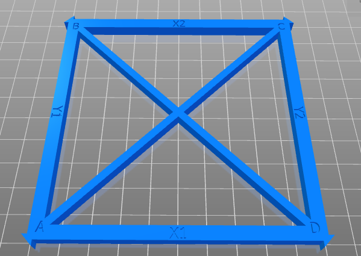

# About Gskewer
Gskewer is a tool to skew transform gcode file coordinates to account for axis misalignment of a 3D printer.

This is a fork of a repository I found a link to in some forum. I don't recall which. A new search found this page whis is likly simular or the same as what I first saw.

[https://www.thingiverse.com/groups/cura/forums/general/topic:31706](https://www.thingiverse.com/groups/cura/forums/general/topic:31706)

In order to use Gskewer you will need to print a test ~~cube~~ squares, take accurate measurements of the ~~cube~~ squares, then input those measurements as arguments 
for Gskewer. 

~~The G-code file to be modified, the measured error (in mm), and the distance from zero where the measurement was taken is then entered into skew.py before being run.~~

The method I used was different that what I struck out above. Note that I have a version of Python on my laptop and run scripts from the command line.

# Preparing to use Gskewer
I devised my own way to use the calibration square. First I should point out the skew error I was concerned about was in XY 
as the XY skew became apparent after printing a box with a tight fitting lid. The square for the XY plain that I printed looked like this:

The STL for that is located at [YACS (Yet Another Calibration Square](https://www.thingiverse.com/thing:2563185)

Regardless of skew one would expect X1 = Y1 = 100 mm

I measured X1 as 99.97 mm  
and Y1 as 99.55 mm

The Y1 measurement was far enough out to warrant correction before making further measurements.
100/99.55 is 1.0042 so I applied that correction to Y by scaling Y to 100.42 then reprinted the square with the new scaling.

Note that X1 and Y1 were both measured carefully. Careful to measure along the axis rather than perpendicular to the other axis!

**Square #2 (with Y scaling)** was measured with the following result:

AB is now 99.96
AC is now 142.15

With these two diagonals it is possible to find the tangent required by **skew.py**.
See first equation at [https://www-formula.com/geometry/rhombus/angles](https://www-formula.com/geometry/rhombus/angles)
 
**skew.py** needs the tangent of the angle **pi/2-alpha**
(note python works in radians not degrees)

Used python IDLE as a calculator

~~~~python
>>> import math as m
>>> alpha = m.acos(142.15**2/2/99.96**2-1)
>>> m.tan(m.pi/2-alpha)
0.011140566393579231
~~~~
 

Note 

# Using Gskewer
`skew.py [arguements] file`

Gskewer will automatically generate a new gcode file with "-skewed" added to the file name. If the output file name already exists gskewer will delete 
the existing file and write a new one.

### Example

Called the file **skew.py** the command line as follows:

~~~~bash
python skew.py --xytan 0.01114 --yztan 0.0 --zxtan 0.0 *YACS*.gcode
~~~~

which created the file used to check calibration
*YACS*-skewed.gcode
 
 {subsitute the name of the gcode file in place of *YACS*
 
 I set yztan and zxtan to zero in my case as I was only correcting for xy axis skew.

### Gskewer Arguments

Two different combinations of arguments can be used.  These images define the meaning

`--xyerr`
	Error in the X-axis for the XY pair in mm. (This argument cannot be used with "xytan")

`--xylen`
	Length of the test cube side where the "xyerr" measurement was taken.

`--xytan`
	The error in the ZX pair as a tangent. (zxerr/zxlen)
	As shown in a previous section I used the calculation
	
~~~~python	
	>>> alpha = m.acos(142.15**2/2/99.96**2-1)
    >>> m.tan(m.pi/2-alpha)
~~~~

`--yzerr`
	Error in the Y-axis for the YZ pair in mm. (This argument cannot be used with "yztan")

`--yzlen`
	Length of the test cube side where the "yzerr" measurement was taken.

`--yztan`
	The error in the YZ pair as a tangent. (yzerr/yzlen)

`--zxerr`
	Error in the Z-axis for the ZX pair in mm. (This argument cannot be used with "zxtan")

`--zxlen`
	Length of the test cube side where the "zxerr" measurement was taken.

`--zxtan`
	The error in the ZX pair as a tangent. (zxerr/zxlen)
